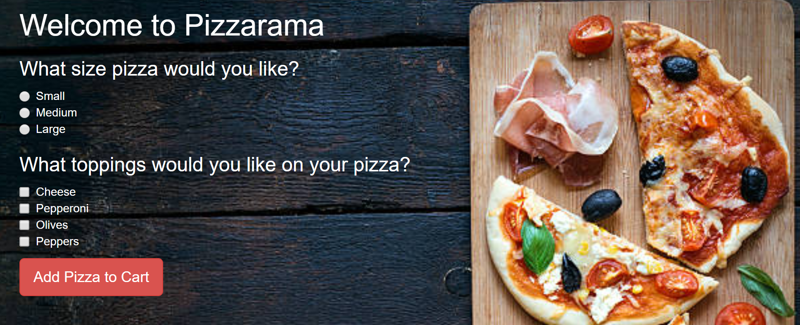

# _{Pizzarama Pizza Delivery}_

#### _{This is a webpage application built using HTML, CSS, Bootstrap, JavaScript, and jQuery, which was built using the behavior-driven development process. It simulates the customization and ordering of a pizza from a fictional pizzaria}, {February 20, 2018}_

#### By _**{Mike B Lambert}**_

## Setup/Installation Requirements

* _Clone this repository using "git clone."_
* _Open index.html in any browser._

## Support and contact details

_{mlamb128@gmail.com}_

## Technologies Used

_{JavaScript, jQuery, HTML, CSS, and Bootstrap.}_

### License

*{MIT License.}*

Copyright (c) 2018 **_{Mike B Lambert}_**
